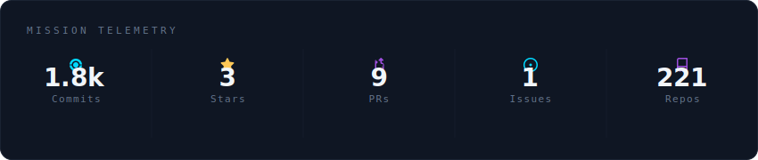

<div align="center">



</div>

---

<div align="center">

### 🚀 Navegando pelo Universo da Inovação e Tecnologia

**Desenvolvedor de Software** • **Especialista em Marketing & Criatividade** • **Pesquisador**

</div>

---

## 🌌 Mission Telemetry

<div align="center">



</div>

---

## 🔭 Tech Stack & Focus Sectors

<div align="center">



</div>

---

## ⭐ Featured Systems

<div align="center">



</div>

---

## 💫 Sobre Mim

Sou um profissional multidisciplinar que combina desenvolvimento de software com expertise em marketing, criatividade e inovação. Atualmente trabalho na **ECONX** em São Paulo, onde transformo ideias em soluções tecnológicas inovadoras.

### 🎯 Minha Abordagem

- **Inovação Centrada**: Acredito que tecnologia e criatividade devem andar juntas
- **Pesquisa & Desenvolvimento**: Constantemente explorando novas tecnologias e metodologias
- **Resolução Criativa de Problemas**: Cada desafio é uma oportunidade de inovação
- **Aprendizado Contínuo**: Sempre curioso, sempre aprendendo

### 🔬 Áreas de Interesse

```javascript
const interesses = {
  desenvolvimento: ["Full Stack", "React", "Node.js", "Python"],
  marketing: ["Marketing Digital", "Growth Hacking", "Brand Strategy"],
  pesquisa: ["Inovação", "User Experience", "Market Insights"],
  criatividade: ["UI/UX Design", "Creative Coding", "Visual Design"]
};
```

---

## 📡 Canais de Comunicação

<div align="center">

[](https://pedrorosemberg.com)
[](https://www.metadax.com.br/pedrorosemberg)
[](https://linkedin.com/in/pedrorosemberg)
[](https://orcid.org/0000-0002-4947-8174)
[](mailto:pedro@metadax.com.br)

</div>

---

## 🎓 Filosofia de Trabalho

> *"Inovação não é apenas sobre tecnologia, é sobre transformar ideias em realidade"*

Acredito no poder da combinação entre conhecimento técnico e pensamento criativo. Cada linha de código, cada estratégia de marketing e cada pesquisa que desenvolvo são guiadas pela busca constante por inovação e excelência.

---

## 🏆 Certificações & Conquistas

<div align="center">


</div>

<br>

<div align="center">

🔬 **Pesquisador Registrado** - ORCID verificado para publicações acadêmicas

🛡️ **Cyber Threat Management** - Especialização em segurança cibernética

📊 **Marketing Science Professional** - Certificação Meta em Marketing Digital

💼 **Digital Marketing Associate** - Credenciamento profissional

🎓 **Meta Certified** - Múltiplas certificações Meta para negócios

🌐 **Globe Academy** - Formação internacional certificada

</div>

---

## 📊 GitHub Analytics

<div align="center">

<!-- GitHub Streak Stats -->
<picture>
  <source
    srcset="https://streak-stats.demolab.com/?user=pedrorosemberg&theme=radical&hide_border=true&background=0a0e1a&ring=00d9ff&fire=ffc857&currStreakLabel=e8e6f0&sideLabels=e8e6f0&currStreakNum=00d9ff&sideNums=9d4edd"
    media="(prefers-color-scheme: dark)"
  />
  <source
    srcset="https://streak-stats.demolab.com/?user=pedrorosemberg&theme=radical&hide_border=true&background=0a0e1a&ring=00d9ff&fire=ffc857&currStreakLabel=e8e6f0&sideLabels=e8e6f0&currStreakNum=00d9ff&sideNums=9d4edd"
    media="(prefers-color-scheme: light), (prefers-color-scheme: no-preference)"
  />
  
</picture>

</div>

---

## 🌟 Contribuições Recentes

<div align="center">

<picture>
  <source
    srcset="https://github-readme-activity-graph.vercel.app/graph?username=pedrorosemberg&theme=react-dark&hide_border=true&area=true&bg_color=0a0e1a&color=00d9ff&line=9d4edd&point=ffc857"
    media="(prefers-color-scheme: dark)"
  />
  <source
    srcset="https://github-readme-activity-graph.vercel.app/graph?username=pedrorosemberg&theme=react-dark&hide_border=true&area=true&bg_color=0a0e1a&color=00d9ff&line=9d4edd&point=ffc857"
    media="(prefers-color-scheme: light), (prefers-color-scheme: no-preference)"
  />
  
</picture>

</div>

---

## 🤝 Vamos Conectar!

Estou sempre aberto para colaborações interessantes, discussões sobre tecnologia e inovação, ou apenas para um bate-papo sobre projetos inovadores!

- 📧 **Email**: pedro@metadax.com.br
- 💼 **LinkedIn**: [/in/pedrorosemberg](https://linkedin.com/in/pedrorosemberg)
- 🌐 **Website**: [pedrorosemberg.com](https://pedrorosemberg.com)
- 🚀 **Metadax**: [metadax.com.br/pedrorosemberg](https://www.metadax.com.br/pedrorosemberg)

---

<div align="center">

### ⚡ "Solving one problem at a time, with code and creativity"


---

**⭐ Se você gostou do meu trabalho, considere dar uma estrela nos repositórios!**


</div>
